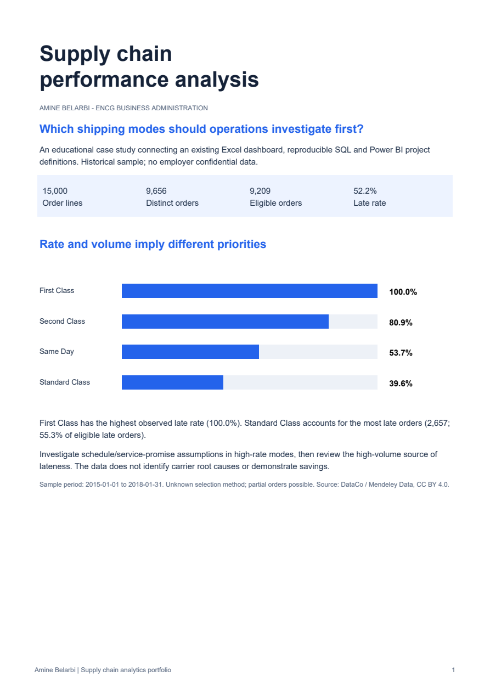

# Supply chain performance: Excel, SQL and Power BI
**Amine Belarbi** - ENCG Business Administration graduate, supply chain and data analytics.

## Business question
Which shipping modes should operations investigate first to reduce late orders in this historical sample?

## Results
- 15,000 order lines represent 9,656 distinct orders.
- 9,209 orders are eligible for shipping performance; 447 canceled/suspected-fraud orders are excluded.
- 4,809 eligible orders are late: **52.2%**.
- **First Class** has the highest observed late rate (100.0%).
- **Standard Class** contributes the most late orders (2,657, 55.3% of late orders). Rate and volume answer different prioritisation questions.

| Mode | Eligible orders | Late orders | Late rate | Avg late days | Share of late orders |
|---|---:|---:|---:|---:|---:|
| First Class | 892 | 892 | 100.0% | 1.00 | 18.5% |
| Second Class | 1,459 | 1,181 | 80.9% | 2.51 | 24.6% |
| Same Day | 147 | 79 | 53.7% | 1.00 | 1.6% |
| Standard Class | 6,711 | 2,657 | 39.6% | 1.50 | 55.3% |

## Explore the work
- [Case study PDF](docs/Amine_Belarbi_Supply_Chain_Case_Study.pdf)
- [Interactive browser dashboard](docs/index.html): download/open locally; mode and market filters recalculate the metrics. This is a browser dashboard, not a Power BI screenshot.
- [Original Excel project, public copy](excel/DataCo_Original_Dashboard_Public_Copy.xlsx): original charts/pivots retained, customer identity/contact columns redacted. Desktop original preserved.
- [Corrected Excel analysis](excel/Supply_Chain_Analysis.xlsx): formulas and editable charts using distinct-order KPIs.
- [SQL schema](sql/01_schema.sql), [views](sql/02_views.sql), [analysis queries](sql/03_analysis.sql), [quality checks](sql/04_quality_checks.sql).
- [Power BI project](powerbi/SupplyChain.pbip): authored semantic model, relationships, DAX measures and report pages. **Native Desktop refresh/render verification is pending.**
- [Data dictionary and KPI definitions](docs/methodology.md)
- [Interview practice guide](docs/interview_practice.md)
- [Validation results](docs/validation.json)

## Reproduce
Requires Python 3.9+ with no third-party packages.
Run from the project folder:

    python scripts/run_analysis.py

This builds a local SQLite database, validates order attributes and exports BI tables. SQL is SQLite dialect; the CTE/window-function concepts also apply to other SQL engines.

For Power BI: follow [setup instructions](powerbi/README.md), set the DataFolder parameter to this project's data folder, and Refresh. Verify the default cards against validation.json before presenting a native Power BI report. Do not call this a completed PBIX until Desktop checks pass.

## Interpretation and limits
This is an educational analysis of an existing 15,000-line sample covering 2015-01-01 to 2018-01-31. The sampling procedure is unknown. Some orders may be partially sampled. Findings describe this sample, not current Morocco operations or an employer's actual performance.
Shipping duration is actual shipping days minus scheduled shipping days; it is not a verified customer receipt timestamp. Cancellation is excluded from the rate and reported separately. No OTIF, stock turnover, carrier causality or claimed realised savings: the needed fields are unavailable.
Recommended next step: inspect scheduling assumptions and service promises for high-rate modes, then investigate the high-volume mode. Test any operational change against a baseline; no intervention has been measured here.

## Attribution and development
Dataset: Constante, Fabian; Silva, Fernando; Pereira, António (2019), DataCo SMART SUPPLY CHAIN FOR BIG DATA ANALYSIS, Mendeley Data V5, DOI 10.17632/8gx2fvg2k6.5. [Original dataset](https://data.mendeley.com/datasets/8gx2fvg2k6/5), CC BY 4.0.
This derivative removes customer personal fields, selects the existing sample, defines order-level metrics and adds analysis/reporting. The version originally downloaded by Amine was not recorded.
Amine's existing Excel work is preserved separately. SQL, report/model definitions, documentation and the corrected workbook were developed with AI assistance. This is a learning portfolio; proficiency claims should reflect what Amine can independently explain and reproduce.
